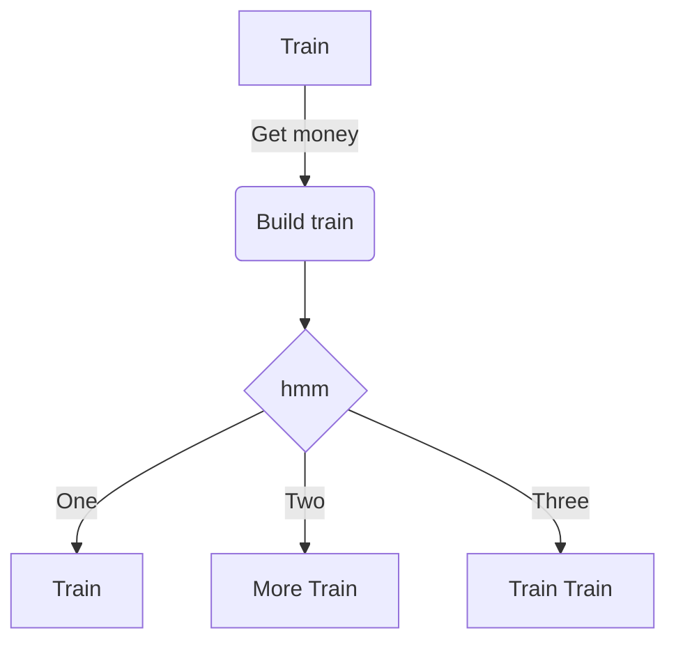

# Railspeeder Systems Overview

This page details all the systems and subsystems of the Railspeeder vehicle and
how they work together.

---

<!-- Edit with https://mermaid.live/ -->

```mermaid
flowchart TD
    A[Train] -->|Get money| B(Build train)
    B --> C{hmm}
    C -->|One| D[Train]
    C -->|Two| E[More Train]
    C -->|Three| F[Train Train]
```
