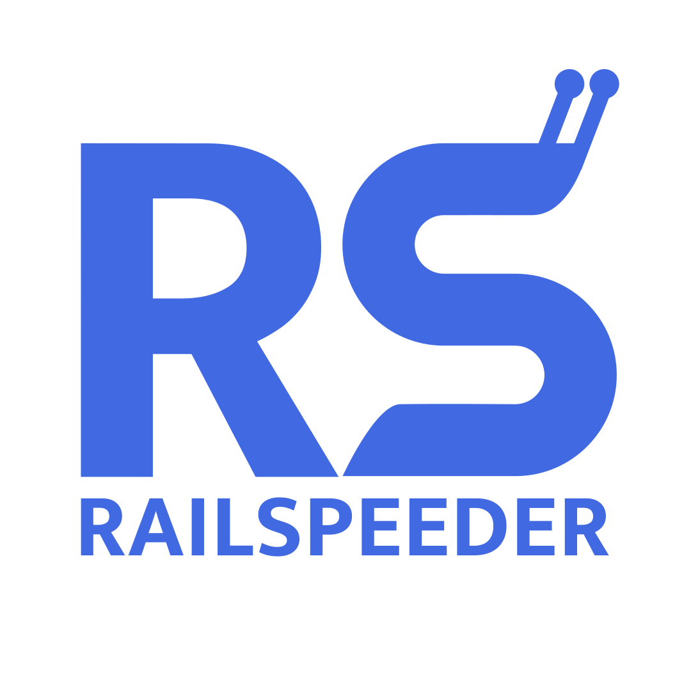

# Railspeeder Project

### A lightweight, all-electric vehicle designed to ride along abandoned rail lines in Santa Cruz for exploration, infrastructure analysis, and restoration planning.

Welcome to the **Railspeeder** project, a student project led by UCSC Slugbotics and Baskin Engineering. Our  mission is to design and build a lightweight electric vehicle capable of traveling along abandoned and decommissioned rail corridors in the greater Santa Cruz area.

This vehicle will serve as a mobile platform for collecting data to assess the condition of these historic rail lines. Key goals include enabling sustainable exploration, identifying restoration needs, and supporting future rail revitalization projects—all with minimal environmental impact.

---

## Project Direcotry

Explore the major subsystems of the Railspeeder:

1. [Rail Speeder Power](docs/Railspeeder-Power)
2. [Rail Speeder Axle](docs/Railspeeder-Axle)
3. [Rail Speeder Propulsion](docs/Railspeeder-Propulsion)
4. [Rail Speeder Chassis](docs/Railspeeder-Chassis)
s